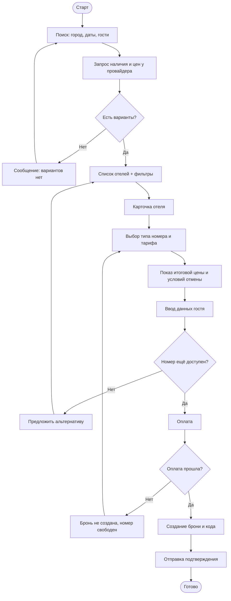
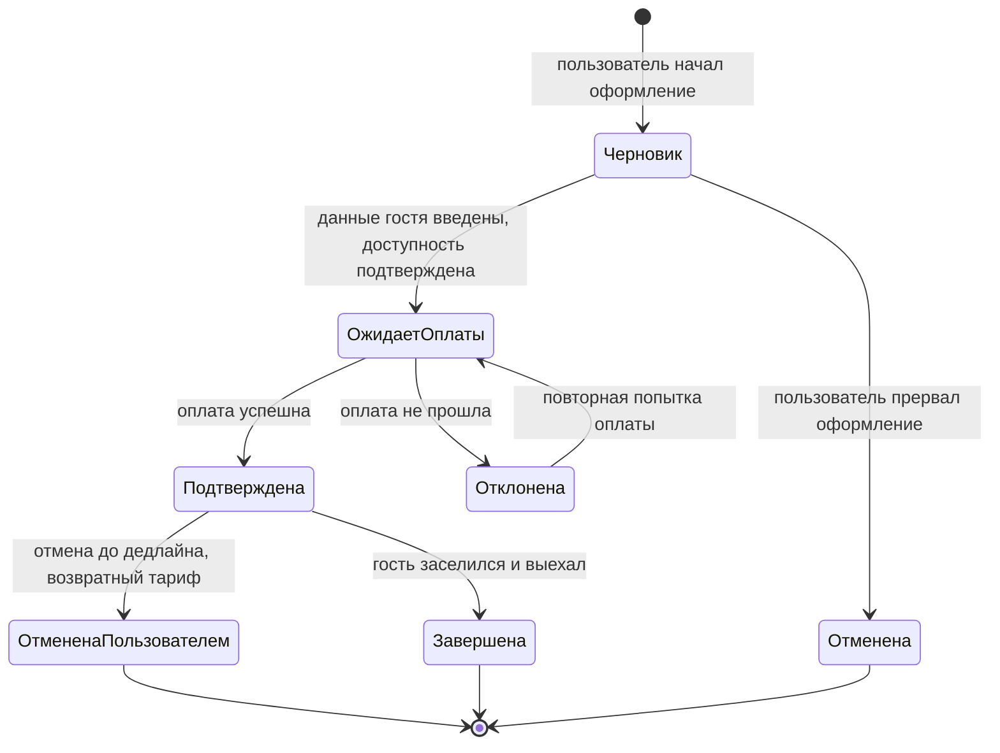

# Бизнес-функция «Бронирование отелей»

> Описание бизнес-функции для сервиса туроператоров:
> глоссарий, бизнес-цели, бизнес-процесс, пользовательская история, ограничения, критерии готовности (DoR) и завершённости (DoD).

---

## 1. Конкурентный анализ (основание для требований)

Перед описанием функции изучены публично доступные сценарии бронирования у профильных сервисов. Сравнение проведено по ключевым возможностям функции «бронирование отеля».

| Возможность | Booking.com | Островок | Яндекс Путешествия | Решение (наш сервис) |
|---|---|---|---|---|
| Поиск по городу/датам/гостям | да | да | да | да |
| Фильтры (цена, звёздность, удобства) | да | да | да | да |
| Карта с отелями | да | да | да | да (v2) |
| Карточка отеля с фото и отзывами | да | да | да | да |
| Выбор типа номера и тарифа | да | да | да | да |
| Бесплатная отмена до даты | да | да | да | да |
| Онлайн-оплата картой | да | да | да | да |
| Оплата при заселении | да | частично | частично | да |
| Программа лояльности / бонусы | да | да | да | да (v2) |

**Выводы для требований:**
- Базовый ожидаемый пользователем флоу: *поиск → фильтрация → карточка отеля → выбор номера и тарифа → оформление → оплата → подтверждение*. Отсутствие любого шага воспринимается как неполнота продукта.
- Возможность **бесплатной отмены** и **прозрачное отображение итоговой цены** (с налогами и сборами) — гигиенический минимум; их отсутствие — конкурентный проигрыш.
- Карта и программа лояльности — важные, но не критичные для MVP возможности, выносятся во вторую версию.

---

## 2. Глоссарий

| Термин | Определение |
|---|---|
| **Отель** | Объект размещения, доступный для бронирования через сервис. |
| **Номер (тип номера)** | Категория размещения в отеле (например, «Стандарт 2-местный»), имеющая цену и условия. |
| **Тариф** | Условия проживания и оплаты для типа номера (с завтраком / без, возвратный / невозвратный). |
| **Доступность (наличие)** | Количество свободных номеров выбранного типа на запрошенные даты. |
| **Бронирование (бронь)** | Подтверждённое резервирование номера на конкретные даты для конкретного гостя. |
| **Гость** | Лицо, на которое оформляется проживание (может не совпадать с пользователем). |
| **Пользователь** | Авторизованное или анонимное лицо, оформляющее бронирование в сервисе. |
| **PNR / код бронирования** | Уникальный идентификатор брони, по которому её можно найти и управлять ею. |
| **Бесплатная отмена** | Возможность отменить бронь без штрафа до указанной даты/времени. |
| **Провайдер размещения** | Внешняя система (channel manager / PMS отеля), предоставляющая данные о наличии и ценах. |
| **MVP** | Minimum Viable Product - минимально жизнеспособный набор функциональности. |

---

## 3. Бизнес-цели

1. **Дать пользователю возможность самостоятельно забронировать отель онлайн** за минимальное число шагов, без обращения к менеджеру.
2. **Увеличить конверсию** из поиска в подтверждённое бронирование за счёт прозрачной цены и понятного флоу.
3. **Снизить долю отмен и спорных обращений** за счёт чётких правил тарифа и условий отмены, показанных до оплаты.
4. **Обеспечить актуальность данных о наличии и цене** через интеграцию с провайдерами размещения, чтобы исключить овербукинг.

Критерии успешности (предварительный этап): пользователь может пройти весь сценарий бронирования без участия оператора; итоговая цена при оплате совпадает с ценой, показанной в карточке; подтверждение брони доставляется пользователю.

---

## 4. Описание бизнес-процесса

Основной сценарий бронирования отеля:

1. Пользователь задаёт параметры поиска: город/отель, даты заезда и выезда, число гостей.
2. Сервис запрашивает у провайдера размещения наличие и цены и показывает список отелей.
3. Пользователь применяет фильтры (цена, звёздность, удобства) и открывает карточку отеля.
4. Пользователь выбирает тип номера и тариф; сервис показывает итоговую цену с налогами и сборами и условия отмены.
5. Пользователь заполняет данные гостя и контактные данные.
6. Сервис повторно проверяет доступность и фиксирует цену.
7. Пользователь оплачивает (онлайн картой) либо выбирает оплату при заселении (если тариф позволяет).
8. Сервис создаёт бронь, присваивает код бронирования и отправляет подтверждение.

**Ключевые проверки и развилки:**
- Если на шаге 6 номер стал недоступен - пользователю предлагается альтернатива, бронь не создаётся.
- Если оплата не прошла - бронь не подтверждается, номер не блокируется.
- Невозвратный тариф - отмена недоступна, об этом сообщается до оплаты.

**Блок-схема процесса бронирования (Mermaid):**

**Диаграмма состояний брони (Mermaid)** — по технике «Диаграммы состояний»:

---

## 5. Модель данных

Основные сущности бизнес-функции, их атрибуты и связи. Кратность связей определена с уточняющими вопросами: один отель имеет много типов номеров; у типа номера — несколько тарифов; бронь относится к одному тарифу и одному гостю.

### 5.1. Связи между сущностями

| Связь | Тип | Описание |
|---|---|---|
| Отель — Номер | один ко многим | В одном отеле много типов номеров |
| Номер — Тариф | один ко многим | У типа номера несколько тарифов |
| Тариф — Бронь | один ко многим | По одному тарифу может быть много броней |
| Гость — Бронь | один ко многим | На одного гостя может быть оформлено несколько броней |
| Пользователь - Бронь | один ко многим | Один пользователь создаёт много броней |
| Бронь — Оплата | один к одному | У каждой брони одна оплата |

### 5.2. Сущности и атрибуты

**Отель** - каталог объектов размещения.

| Атрибут | Тип | Описание |
|---|---|---|
| id | целое (ключ) | Уникальный идентификатор отеля |
| название | строка | Название отеля |
| звёздность | целое | Категория (1–5 звёзд) |
| город | строка | Город расположения |
| адрес | строка | Адрес отеля |

**Номер** - тип размещения внутри отеля.

| Атрибут | Тип | Описание |
|---|---|---|
| id | целое (ключ) | Уникальный идентификатор номера |
| id отеля | целое (внешний ключ) | Ссылка на отель |
| тип | строка | Категория номера (например, «Стандарт 2-местный») |
| вместимость | целое | Максимальное число гостей |

**Тариф** - условия проживания и цена для типа номера.

| Атрибут | Тип | Описание |
|---|---|---|
| id | целое (ключ) | Уникальный идентификатор тарифа |
| id номера | целое (внешний ключ) | Ссылка на тип номера |
| название | строка | Название тарифа |
| цена | число | Стоимость за ночь |
| возвратный | да/нет | Возможна ли бесплатная отмена |
| дедлайн отмены | дата | До какого момента можно отменить без штрафа |

**Бронь** - центральная сущность: подтверждённое резервирование.

| Атрибут | Тип | Описание |
|---|---|---|
| id | целое (ключ) | Уникальный идентификатор брони |
| код бронирования | строка | Код для поиска и управления бронью |
| id тарифа | целое (внешний ключ) | Выбранный тариф |
| id гостя | целое (внешний ключ) | Гость проживания |
| id пользователя | целое (внешний ключ) | Кто оформил бронь |
| дата заезда | дата | Дата начала проживания |
| дата выезда | дата | Дата окончания проживания |
| статус | строка | Состояние брони (черновик, ожидает оплаты, подтверждена и т.д.) |
| итоговая цена | число | Зафиксированная цена брони |

**Гость** - лицо, на которое оформляется проживание.

| Атрибут | Тип | Описание |
|---|---|---|
| id | целое (ключ) | Уникальный идентификатор гостя |
| ФИО | строка | Фамилия, имя, отчество |
| документ | строка | Данные документа гостя |

**Пользователь** - лицо, оформляющее бронирование.

| Атрибут | Тип | Описание |
|---|---|---|
| id | целое (ключ) | Уникальный идентификатор пользователя |
| email | строка | Электронная почта |
| телефон | строка | Контактный телефон |

**Оплата** - данные о платеже за бронь.

| Атрибут | Тип | Описание |
|---|---|---|
| id | целое (ключ) | Уникальный идентификатор оплаты |
| id брони | целое (внешний ключ) | Ссылка на бронь |
| сумма | число | Сумма платежа |
| статус | строка | Состояние оплаты (ожидает, проведена, отклонена) |
| способ | строка | Способ оплаты (карта, при заселении) |

**Пояснения к модели:**
- **Гость** и **Пользователь** разделены: оформляющий бронь может не быть гостем (бронь на другое лицо).
- **Оплата** вынесена в отдельную сущность (одна оплата на одну бронь); платёжные реквизиты карты не хранятся - только сумма, статус и способ.

---

## 6. Пользовательская история (User Story)

**Основная US:**

> **Как** пользователь сервиса туроператора
> **Я хочу** найти и забронировать отель на нужные даты с онлайн-оплатой
> **Чтобы** организовать проживание в поездке без обращения к менеджеру.

**Декомпозиция на низкоуровневые истории:**

- Как пользователь, я хочу искать отели по городу, датам и числу гостей, чтобы видеть подходящие варианты.
- Как пользователь, я хочу фильтровать результаты по цене и удобствам, чтобы быстрее выбрать.
- Как пользователь, я хочу видеть итоговую цену с налогами и условия отмены до оплаты, чтобы не получить сюрприз.
- Как пользователь, я хочу оплатить бронь картой онлайн, чтобы сразу подтвердить размещение.
- Как пользователь, я хочу получить код бронирования и подтверждение, чтобы управлять бронью.

**Acceptance Criteria для основной US:**

- Пользователь может задать город, даты заезда/выезда и число гостей; дата выезда строго позже даты заезда.
- При отсутствии вариантов система показывает сообщение, а не пустой экран.
- В карточке отеля видны фото, описание, тип номера, тариф и итоговая цена с учётом налогов и сборов.
- Условия отмены показаны до подтверждения оплаты.
- Перед оплатой выполняется повторная проверка доступности; при недоступности бронь не создаётся и предлагается альтернатива.
- После успешной оплаты создаётся бронь с уникальным кодом, пользователь получает подтверждение.
- При неуспешной оплате бронь не подтверждается, средства не списываются окончательно.

---

## 7. Ограничения

**Функциональные ограничения / бизнес-правила:**
- Минимальный срок бронирования - 1 ночь.
- Дата заезда не может быть в прошлом.
- Бронирование возможно только при подтверждённой доступности от провайдера на момент оплаты.
- Невозвратный тариф не подлежит отмене и возврату средств.
- На одно бронирование оформляется один тип номера (несколько номеров/типов - отдельные брони в MVP).

**Нефункциональные ограничения:**
- **Производительность:** выдача результатов поиска - не более 3 секунд при типовой нагрузке.
- **Доступность:** целевая доступность сервиса бронирования - 99%.
- **Масштабируемость:** поддержка не менее 1000 одновременных пользователей в пике.
- **Данные:** персональные данные гостя хранятся в соответствии с законодательством (152-ФЗ), передача данных шифруется; платёжные данные не хранятся на стороне сервиса (PCI DSS - на стороне платёжного провайдера).
- **Актуальность:** данные о наличии и цене кэшируются не дольше согласованного с провайдером интервала; перед оплатой - обязательная сверка в реальном времени.

**Интеграционные ограничения:**
- Зависимость от внешнего провайдера размещения: при его недоступности поиск и бронирование невозможны - нужен сценарий деградации (сообщение пользователю, повтор запроса).
- Зависимость от платёжного провайдера для онлайн-оплаты.

---

## 8. Критерии устойчивости / готовности (DoR)

Бизнес-функция готова к передаче в разработку, если:

- [ ] Цель функции и критерии успешности согласованы с заказчиком.
- [ ] Основной сценарий и альтернативы (недоступность, отказ оплаты, невозвратный тариф) описаны.
- [ ] Определены и зафиксированы интеграции (провайдер размещения, платёжный провайдер) и их контракты.
- [ ] Модель данных (отель, номер, тариф, бронь, гость) определена.
- [ ] Нефункциональные требования (производительность, доступность, защита данных) сформулированы и измеримы.
- [ ] Acceptance Criteria согласованы командой.
- [ ] Зависимости от других US/систем зафиксированы; ресурсы и доступы к тестовым контурам провайдеров доступны.
- [ ] DoD определены и утверждены командой.

---

## 9. Критерии завершённости (DoD)

Бизнес-функция считается завершённой и готовой к передаче в эксплуатацию, если:

- [ ] Реализация соответствует всем Acceptance Criteria основной US и низкоуровневых историй.
- [ ] Основной сценарий и все альтернативные сценарии (недоступность номера, отказ оплаты, невозвратный тариф, отмена) протестированы.
- [ ] Интеграции с провайдером размещения и платёжным провайдером проверены на тестовом контуре, включая сценарии деградации.
- [ ] Нефункциональные требования подтверждены.
- [ ] Описание функции проверено на полноту, непротиворечивость и однозначность; все артефакты (глоссарий, модель данных, бизнес-процесс, US) согласованы.
- [ ] Документация (описание функции, интеграционные контракты) создана/обновлена.
- [ ] Все необходимые одобрения получены; продукт утверждён заказчиком (QA + приёмка).
- [ ] Риски (овербукинг, двойное списание, потеря брони) оценены и закрыты.

---
