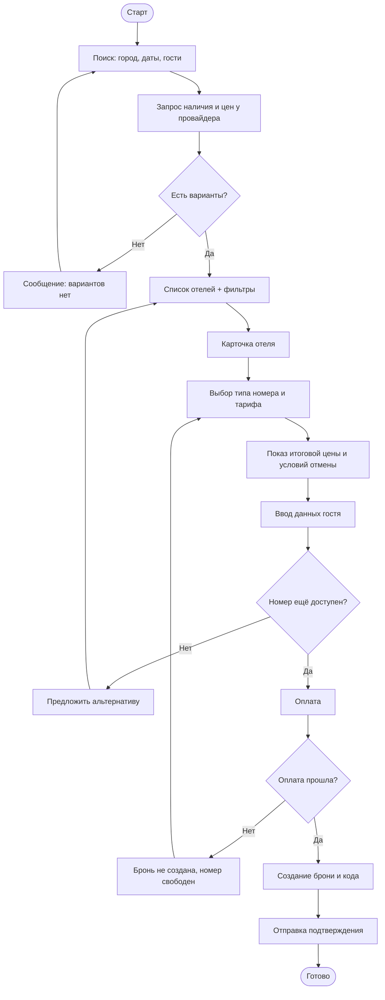
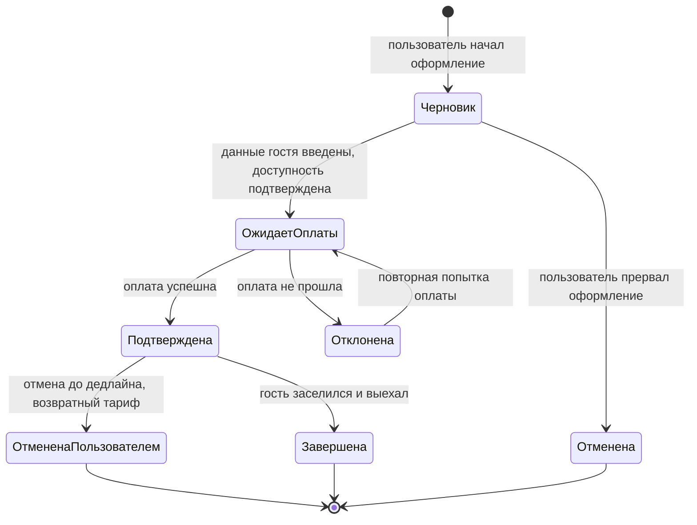

# Бизнес-функция «Бронирование отелей»

> Описание бизнес-функции для сервиса туроператоров:
> глоссарий, бизнес-цели, бизнес-процесс, пользовательская история, ограничения, критерии готовности (DoR) и завершённости (DoD).

---

## 1. Конкурентный анализ (основание для требований)

Перед описанием функции изучены публично доступные сценарии бронирования у профильных сервисов. Сравнение проведено по ключевым возможностям функции «бронирование отеля».

| Возможность | Booking.com | Островок | Яндекс Путешествия | Решение (наш сервис) |
|---|---|---|---|---|
| Поиск по городу/датам/гостям | да | да | да | да |
| Фильтры (цена, звёздность, удобства) | да | да | да | да |
| Карта с отелями | да | да | да | да (v2) |
| Карточка отеля с фото и отзывами | да | да | да | да |
| Выбор типа номера и тарифа | да | да | да | да |
| Бесплатная отмена до даты | да | да | да | да |
| Онлайн-оплата картой | да | да | да | да |
| Оплата при заселении | да | частично | частично | да |
| Программа лояльности / бонусы | да | да | да | да (v2) |

**Выводы для требований:**
- Базовый ожидаемый пользователем флоу: *поиск → фильтрация → карточка отеля → выбор номера и тарифа → оформление → оплата → подтверждение*. Отсутствие любого шага воспринимается как неполнота продукта.
- Возможность **бесплатной отмены** и **прозрачное отображение итоговой цены** (с налогами и сборами) — гигиенический минимум; их отсутствие — конкурентный проигрыш.
- Карта и программа лояльности — важные, но не критичные для MVP возможности, выносятся во вторую версию.

---

## 2. Глоссарий

| Термин | Определение |
|---|---|
| **Отель** | Объект размещения, доступный для бронирования через сервис. |
| **Номер (тип номера)** | Категория размещения в отеле (например, «Стандарт 2-местный»), имеющая цену и условия. |
| **Тариф** | Условия проживания и оплаты для типа номера (с завтраком / без, возвратный / невозвратный). |
| **Доступность (наличие)** | Количество свободных номеров выбранного типа на запрошенные даты. |
| **Бронирование (бронь)** | Подтверждённое резервирование номера на конкретные даты для конкретного гостя. |
| **Гость** | Лицо, на которое оформляется проживание (может не совпадать с пользователем). |
| **Пользователь** | Авторизованное или анонимное лицо, оформляющее бронирование в сервисе. |
| **PNR / код бронирования** | Уникальный идентификатор брони, по которому её можно найти и управлять ею. |
| **Бесплатная отмена** | Возможность отменить бронь без штрафа до указанной даты/времени. |
| **Провайдер размещения** | Внешняя система (channel manager / PMS отеля), предоставляющая данные о наличии и ценах. |
| **MVP** | Minimum Viable Product - минимально жизнеспособный набор функциональности. |

---

## 3. Бизнес-цели

1. **Дать пользователю возможность самостоятельно забронировать отель онлайн** за минимальное число шагов, без обращения к менеджеру.
2. **Увеличить конверсию** из поиска в подтверждённое бронирование за счёт прозрачной цены и понятного флоу.
3. **Снизить долю отмен и спорных обращений** за счёт чётких правил тарифа и условий отмены, показанных до оплаты.
4. **Обеспечить актуальность данных о наличии и цене** через интеграцию с провайдерами размещения, чтобы исключить овербукинг.

Критерии успешности (предварительный этап): пользователь может пройти весь сценарий бронирования без участия оператора; итоговая цена при оплате совпадает с ценой, показанной в карточке; подтверждение брони доставляется пользователю.

---

## 4. Описание бизнес-процесса

Основной сценарий бронирования отеля:

1. Пользователь задаёт параметры поиска: город/отель, даты заезда и выезда, число гостей.
2. Сервис запрашивает у провайдера размещения наличие и цены и показывает список отелей.
3. Пользователь применяет фильтры (цена, звёздность, удобства) и открывает карточку отеля.
4. Пользователь выбирает тип номера и тариф; сервис показывает итоговую цену с налогами и сборами и условия отмены.
5. Пользователь заполняет данные гостя и контактные данные.
6. Сервис повторно проверяет доступность и фиксирует цену.
7. Пользователь оплачивает (онлайн картой) либо выбирает оплату при заселении (если тариф позволяет).
8. Сервис создаёт бронь, присваивает код бронирования и отправляет подтверждение.

**Ключевые проверки и развилки:**
- Если на шаге 6 номер стал недоступен - пользователю предлагается альтернатива, бронь не создаётся.
- Если оплата не прошла - бронь не подтверждается, номер не блокируется.
- Невозвратный тариф - отмена недоступна, об этом сообщается до оплаты.

**Блок-схема процесса бронирования (Mermaid):**

**Диаграмма состояний брони (Mermaid)** — по технике «Диаграммы состояний»:

---

## 4а. BPMN-диаграмма процесса (нотация BPMN 2.0)

Ниже бизнес-процесс из раздела 4 представлен в нотации **BPMN 2.0**. Развёрнутый пул **«Бронирование отеля»** содержит две дорожки: **«Пользователь»** (действия с участием человека - User Task) и **«Сервис бронирования»** (автоматические действия - Service Task). Внешние системы - **провайдер размещения** и **платёжный провайдер** - показаны свёрнутыми пулами («чёрный ящик»), взаимодействие с ними идёт через потоки сообщений (пунктир).

Схема построена по правилам нотации:
- есть явное **стартовое событие** («Заявка на бронирование получена») и **отдельное завершающее событие на каждый исход** (вариантов нет / номер недоступен / оплата не прошла / бронь подтверждена) - это позволяет собирать статистику по причинам незавершения;
- ветвления оформлены через **исключающие шлюзы (XOR)**, перед которыми и после которых стоят задачи; слияние и разведение не смешиваются в одном шлюзе;
- системные действия помечены маркером **Service Task**, а не вынесены в отдельную дорожку «Система»;
- внешние участники вынесены в **свёрнутые пулы**, чтобы не загромождать диаграмму, а связь с ними — только потоками сообщений.

<svg viewBox="0 0 1720 800" xmlns="http://www.w3.org/2000/svg" role="img" aria-label="BPMN диаграмма бронирования отеля">
      <defs>
        <marker id="seq" markerWidth="11" markerHeight="11" refX="8.5" refY="4" orient="auto" markerUnits="userSpaceOnUse">
          <path d="M0,0 L9,4 L0,8 Z" fill="#2b3242"/>
        </marker>
        <marker id="msg" markerWidth="12" markerHeight="12" refX="9" refY="4.5" orient="auto" markerUnits="userSpaceOnUse">
          <path d="M0.5,0.5 L9,4.5 L0.5,8.5 Z" fill="#fff" stroke="#2b3242" stroke-width="1"/>
        </marker>
        <marker id="msgstart" markerWidth="9" markerHeight="9" refX="4.5" refY="4.5" orient="auto" markerUnits="userSpaceOnUse">
          <circle cx="4.5" cy="4.5" r="3.4" fill="#fff" stroke="#2b3242" stroke-width="1"/>
        </marker>
      </defs>

      <!-- TOP collapsed pool -->
      <rect x="20" y="20" width="1680" height="54" fill="#eef1f5" stroke="#2b3242" stroke-width="1.2"/>
      <text x="34" y="51" font-size="13" font-weight="600">Провайдер размещения (внешняя система)</text>

      <!-- MAIN pool header -->
      <rect x="20" y="88" width="26" height="560" fill="#eef1f5" stroke="#2b3242" stroke-width="1.2"/>
      <text x="38" y="368" font-size="13" font-weight="700" transform="rotate(-90 38 368)" text-anchor="middle">Бронирование отеля</text>

      <!-- lane Пользователь -->
      <rect x="46" y="88" width="1654" height="180" fill="#f7f8fa" stroke="#2b3242" stroke-width="1"/>
      <rect x="46" y="88" width="24" height="180" fill="#fdfdfe" stroke="#2b3242" stroke-width="1"/>
      <text x="62" y="178" font-size="12" font-weight="600" transform="rotate(-90 62 178)" text-anchor="middle">Пользователь</text>

      <!-- lane Сервис -->
      <rect x="46" y="268" width="1654" height="380" fill="#fdfdfe" stroke="#2b3242" stroke-width="1"/>
      <rect x="46" y="268" width="24" height="380" fill="#fdfdfe" stroke="#2b3242" stroke-width="1"/>
      <text x="62" y="458" font-size="12" font-weight="600" transform="rotate(-90 62 458)" text-anchor="middle">Сервис бронирования</text>

      <!-- BOTTOM collapsed pool -->
      <rect x="20" y="662" width="1680" height="52" fill="#eef1f5" stroke="#2b3242" stroke-width="1.2"/>
      <text x="34" y="693" font-size="13" font-weight="600">Платёжный провайдер (внешняя система)</text>

      <!-- ===== USER LANE (y center ~178) ===== -->
      <!-- Start (message) -->
      <circle cx="108" cy="178" r="16" fill="#fff" stroke="#2b3242" stroke-width="2"/>
      <path d="M100 173 h16 v10 h-16 z" fill="none" stroke="#2b3242" stroke-width="1.2"/>
      <path d="M100 173 l8 6 l8 -6" fill="none" stroke="#2b3242" stroke-width="1.2"/>
      <text x="108" y="214" font-size="10.5" text-anchor="middle">Заявка на</text>
      <text x="108" y="226" font-size="10.5" text-anchor="middle">бронирование</text>
      <text x="108" y="238" font-size="10.5" text-anchor="middle">получена</text>

      <!-- Задать параметры поиска -->
      <g><rect x="158" y="151" width="96" height="54" rx="9" fill="#fff" stroke="#2b3242" stroke-width="1.4"/>
        <text x="206" y="174" font-size="10.5" text-anchor="middle">Задать</text>
        <text x="206" y="187" font-size="10.5" text-anchor="middle">параметры</text>
        <text x="206" y="200" font-size="10.5" text-anchor="middle">поиска</text>
        <circle cx="168" cy="162" r="4.2" fill="none" stroke="#2b3242" stroke-width="1"/>
        <path d="M163.8 170 a4.2 3 0 0 1 8.4 0" fill="none" stroke="#2b3242" stroke-width="1"/></g>

      <!-- Выбрать отель, номер и тариф -->
      <g><rect x="560" y="151" width="106" height="54" rx="9" fill="#fff" stroke="#2b3242" stroke-width="1.4"/>
        <text x="613" y="171" font-size="10" text-anchor="middle">Выбрать отель,</text>
        <text x="613" y="184" font-size="10" text-anchor="middle">номер</text>
        <text x="613" y="197" font-size="10" text-anchor="middle">и тариф</text>
        <circle cx="570" cy="162" r="4.2" fill="none" stroke="#2b3242" stroke-width="1"/>
        <path d="M565.8 170 a4.2 3 0 0 1 8.4 0" fill="none" stroke="#2b3242" stroke-width="1"/></g>

      <!-- Ввести данные гостя -->
      <g><rect x="712" y="151" width="100" height="54" rx="9" fill="#fff" stroke="#2b3242" stroke-width="1.4"/>
        <text x="762" y="174" font-size="10.5" text-anchor="middle">Ввести</text>
        <text x="762" y="187" font-size="10.5" text-anchor="middle">данные</text>
        <text x="762" y="200" font-size="10.5" text-anchor="middle">гостя</text>
        <circle cx="722" cy="162" r="4.2" fill="none" stroke="#2b3242" stroke-width="1"/>
        <path d="M717.8 170 a4.2 3 0 0 1 8.4 0" fill="none" stroke="#2b3242" stroke-width="1"/></g>

      <!-- Оплатить бронь -->
      <g><rect x="1010" y="151" width="96" height="54" rx="9" fill="#fff" stroke="#2b3242" stroke-width="1.4"/>
        <text x="1058" y="181" font-size="10.5" text-anchor="middle">Оплатить</text>
        <text x="1058" y="194" font-size="10.5" text-anchor="middle">бронь</text>
        <circle cx="1020" cy="162" r="4.2" fill="none" stroke="#2b3242" stroke-width="1"/>
        <path d="M1015.8 170 a4.2 3 0 0 1 8.4 0" fill="none" stroke="#2b3242" stroke-width="1"/></g>

      <!-- ===== SERVICE LANE (y center ~430) ===== -->
      <!-- Запросить наличие и цены -->
      <g><rect x="300" y="403" width="104" height="54" rx="9" fill="#fff" stroke="#2b3242" stroke-width="1.4"/>
        <text x="352" y="423" font-size="10.5" text-anchor="middle">Запросить</text>
        <text x="352" y="436" font-size="10.5" text-anchor="middle">наличие</text>
        <text x="352" y="449" font-size="10.5" text-anchor="middle">и цены</text>
        <g transform="translate(310,414)" stroke="#2b3242" stroke-width="1" fill="none"><circle r="3.3"/><circle r="1.2"/></g></g>

      <!-- XOR есть варианты -->
      <g><rect x="448" y="410" width="40" height="40" transform="rotate(45 468 430)" fill="#fff" stroke="#2b3242" stroke-width="1.4"/>
        <path d="M461 423 L475 437 M475 423 L461 437" stroke="#2b3242" stroke-width="1.6"/>
        <text x="468" y="472" font-size="9.5" text-anchor="middle">Есть варианты?</text></g>

      <!-- End: вариантов нет -->
      <circle cx="468" cy="560" r="15" fill="#fff" stroke="#2b3242" stroke-width="3"/>
      <text x="468" y="592" font-size="10" text-anchor="middle">Вариантов нет</text>

      <!-- Проверить доступность и зафиксировать цену -->
      <g><rect x="610" y="403" width="116" height="54" rx="9" fill="#fff" stroke="#2b3242" stroke-width="1.4"/>
        <text x="668" y="421" font-size="9.5" text-anchor="middle">Проверить</text>
        <text x="668" y="433" font-size="9.5" text-anchor="middle">доступность и</text>
        <text x="668" y="445" font-size="9.5" text-anchor="middle">зафиксировать цену</text>
        <g transform="translate(620,414)" stroke="#2b3242" stroke-width="1" fill="none"><circle r="3.3"/><circle r="1.2"/></g></g>

      <!-- XOR номер доступен -->
      <g><rect x="770" y="410" width="40" height="40" transform="rotate(45 790 430)" fill="#fff" stroke="#2b3242" stroke-width="1.4"/>
        <path d="M783 423 L797 437 M797 423 L783 437" stroke="#2b3242" stroke-width="1.6"/>
        <text x="790" y="472" font-size="9.5" text-anchor="middle">Номер доступен?</text></g>

      <!-- End: предложить альтернативу / бронь не создана (номер) -->
      <circle cx="790" cy="560" r="15" fill="#fff" stroke="#2b3242" stroke-width="3"/>
      <text x="790" y="588" font-size="9.5" text-anchor="middle">Номер недоступен,</text>
      <text x="790" y="600" font-size="9.5" text-anchor="middle">предложена альтернатива</text>

      <!-- Провести платёж -->
      <g><rect x="1010" y="403" width="100" height="54" rx="9" fill="#fff" stroke="#2b3242" stroke-width="1.4"/>
        <text x="1060" y="426" font-size="10.5" text-anchor="middle">Провести</text>
        <text x="1060" y="439" font-size="10.5" text-anchor="middle">платёж</text>
        <g transform="translate(1020,414)" stroke="#2b3242" stroke-width="1" fill="none"><circle r="3.3"/><circle r="1.2"/></g></g>

      <!-- XOR оплата прошла -->
      <g><rect x="1158" y="410" width="40" height="40" transform="rotate(45 1178 430)" fill="#fff" stroke="#2b3242" stroke-width="1.4"/>
        <path d="M1171 423 L1185 437 M1185 423 L1171 437" stroke="#2b3242" stroke-width="1.6"/>
        <text x="1178" y="472" font-size="9.5" text-anchor="middle">Оплата прошла?</text></g>

      <!-- End: оплата не прошла -->
      <circle cx="1178" cy="560" r="15" fill="#fff" stroke="#2b3242" stroke-width="3"/>
      <text x="1178" y="588" font-size="9.5" text-anchor="middle">Оплата не прошла,</text>
      <text x="1178" y="600" font-size="9.5" text-anchor="middle">бронь не создана</text>

      <!-- Создать бронь и код -->
      <g><rect x="1258" y="403" width="104" height="54" rx="9" fill="#fff" stroke="#2b3242" stroke-width="1.4"/>
        <text x="1310" y="422" font-size="10" text-anchor="middle">Создать бронь</text>
        <text x="1310" y="435" font-size="10" text-anchor="middle">и присвоить</text>
        <text x="1310" y="448" font-size="10" text-anchor="middle">код</text>
        <g transform="translate(1268,414)" stroke="#2b3242" stroke-width="1" fill="none"><circle r="3.3"/><circle r="1.2"/></g></g>

      <!-- Отправить подтверждение -->
      <g><rect x="1418" y="403" width="110" height="54" rx="9" fill="#fff" stroke="#2b3242" stroke-width="1.4"/>
        <text x="1473" y="422" font-size="9.5" text-anchor="middle">Отправить</text>
        <text x="1473" y="434" font-size="9.5" text-anchor="middle">подтверждение</text>
        <text x="1473" y="446" font-size="9.5" text-anchor="middle">и код брони</text>
        <g transform="translate(1428,414)" stroke="#2b3242" stroke-width="1" fill="none"><circle r="3.3"/><circle r="1.2"/></g></g>

      <!-- End: бронь подтверждена (message end) -->
      <circle cx="1600" cy="430" r="16" fill="#1d2433" stroke="#1d2433" stroke-width="2"/>
      <path d="M1591 424 h18 v12 h-18 z" fill="none" stroke="#fff" stroke-width="1.4"/>
      <path d="M1591 424 l9 7 l9 -7" fill="none" stroke="#fff" stroke-width="1.4"/>
      <text x="1600" y="466" font-size="10" text-anchor="middle">Бронь</text>
      <text x="1600" y="478" font-size="10" text-anchor="middle">подтверждена</text>

      <!-- ===== SEQUENCE FLOWS ===== -->
      <path d="M124 178 H158" fill="none" stroke="#2b3242" stroke-width="1.4" marker-end="url(#seq)"/>
      <!-- задать параметры -> запросить наличие (вниз в сервис-дорожку) -->
      <path d="M254 178 H280 V430 H300" fill="none" stroke="#2b3242" stroke-width="1.4" marker-end="url(#seq)"/>
      <!-- запросить -> XOR есть варианты -->
      <path d="M404 430 H440" fill="none" stroke="#2b3242" stroke-width="1.4" marker-end="url(#seq)"/>
      <!-- XOR -> вариантов нет (вниз) -->
      <path d="M468 459 V545" fill="none" stroke="#2b3242" stroke-width="1.4" marker-end="url(#seq)"/>
      <text x="476" y="510" font-size="10" fill="#6b7280">нет</text>
      <!-- XOR -> выбрать отель (вверх в дорожку пользователя) -->
      <path d="M496 430 H536 V178 H560" fill="none" stroke="#2b3242" stroke-width="1.4" marker-end="url(#seq)"/>
      <text x="544" y="320" font-size="10" fill="#6b7280">да</text>
      <!-- выбрать отель -> ввести данные -->
      <path d="M666 178 H712" fill="none" stroke="#2b3242" stroke-width="1.4" marker-end="url(#seq)"/>
      <!-- ввести данные -> проверить доступность (вниз, вход слева) -->
      <path d="M762 205 V490 H590 V430 H610" fill="none" stroke="#2b3242" stroke-width="1.4" marker-end="url(#seq)"/>
      <!-- проверить доступность -> XOR номер доступен -->
      <path d="M726 430 H762" fill="none" stroke="#2b3242" stroke-width="1.4" marker-end="url(#seq)"/>
      <!-- XOR номер -> недоступен (вниз) -->
      <path d="M790 459 V545" fill="none" stroke="#2b3242" stroke-width="1.4" marker-end="url(#seq)"/>
      <text x="798" y="510" font-size="10" fill="#6b7280">нет</text>
      <!-- XOR номер -> оплатить (вверх в дорожку пользователя) -->
      <path d="M818 430 H950 V178 H1010" fill="none" stroke="#2b3242" stroke-width="1.4" marker-end="url(#seq)"/>
      <text x="900" y="170" font-size="10" fill="#6b7280">да</text>
      <!-- оплатить -> провести платёж (вниз слева от задачи, вход слева) -->
      <path d="M1058 205 V370 H970 V430 H1010" fill="none" stroke="#2b3242" stroke-width="1.4" marker-end="url(#seq)"/>
      <!-- провести платёж -> XOR оплата -->
      <path d="M1110 430 H1150" fill="none" stroke="#2b3242" stroke-width="1.4" marker-end="url(#seq)"/>
      <!-- XOR оплата -> не прошла (вниз) -->
      <path d="M1178 459 V545" fill="none" stroke="#2b3242" stroke-width="1.4" marker-end="url(#seq)"/>
      <text x="1186" y="510" font-size="10" fill="#6b7280">нет</text>
      <!-- XOR оплата -> создать бронь (да) -->
      <path d="M1206 430 H1258" fill="none" stroke="#2b3242" stroke-width="1.4" marker-end="url(#seq)"/>
      <text x="1210" y="423" font-size="10" fill="#6b7280">да</text>
      <!-- создать бронь -> отправить подтверждение -->
      <path d="M1362 430 H1418" fill="none" stroke="#2b3242" stroke-width="1.4" marker-end="url(#seq)"/>
      <!-- отправить -> бронь подтверждена -->
      <path d="M1528 430 H1584" fill="none" stroke="#2b3242" stroke-width="1.4" marker-end="url(#seq)"/>

      <!-- ===== MESSAGE FLOWS to external pools (dashed, one initiating flow each) ===== -->
      <!-- Запросить наличие: запрос к провайдеру размещения -->
      <path d="M352 403 V74" fill="none" stroke="#2b3242" stroke-width="1.2" stroke-dasharray="6 4" marker-start="url(#msgstart)" marker-end="url(#msg)"/>
      <text x="360" y="116" font-size="9.5" fill="#6b7280">запрос наличия и цен</text>
      <!-- Сверка доступности: запрос к провайдеру размещения -->
      <path d="M690 403 V74" fill="none" stroke="#2b3242" stroke-width="1.2" stroke-dasharray="6 4" marker-start="url(#msgstart)" marker-end="url(#msg)"/>
      <text x="698" y="116" font-size="9.5" fill="#6b7280">сверка доступности</text>
      <!-- Платёж: запрос к платёжному провайдеру -->
      <path d="M1060 457 V662" fill="none" stroke="#2b3242" stroke-width="1.2" stroke-dasharray="6 4" marker-start="url(#msgstart)" marker-end="url(#msg)"/>
      <text x="1068" y="540" font-size="9.5" fill="#6b7280">запрос платежа</text>
    </svg>

**Соответствие шагам из раздела 4:**

| Шаг (раздел 4) | Элемент BPMN |
|---|---|
| Параметры поиска | User Task «Задать параметры поиска» |
| Запрос наличия и цен | Service Task «Запросить наличие и цены» + поток сообщений к провайдеру; шлюз «Есть варианты?» |
| Выбор отеля, номера и тарифа | User Task «Выбрать отель, номер и тариф» |
| Данные гостя | User Task «Ввести данные гостя» |
| Повторная проверка доступности | Service Task «Проверить доступность и зафиксировать цену»; шлюз «Номер доступен?» |
| Оплата | User Task «Оплатить бронь» + Service Task «Провести платёж» (поток сообщений к платёжному провайдеру); шлюз «Оплата прошла?» |
| Создание брони и подтверждение | Service Task «Создать бронь и присвоить код» → «Отправить подтверждение и код брони» → завершающее событие «Бронь подтверждена» |

---

## 5. Модель данных

Основные сущности бизнес-функции, их атрибуты и связи. Кратность связей определена с уточняющими вопросами: один отель имеет много типов номеров; у типа номера — несколько тарифов; бронь относится к одному тарифу и одному гостю.

### 5.1. Связи между сущностями

| Связь | Тип | Описание |
|---|---|---|
| Отель — Номер | один ко многим | В одном отеле много типов номеров |
| Номер — Тариф | один ко многим | У типа номера несколько тарифов |
| Тариф — Бронь | один ко многим | По одному тарифу может быть много броней |
| Гость — Бронь | один ко многим | На одного гостя может быть оформлено несколько броней |
| Пользователь - Бронь | один ко многим | Один пользователь создаёт много броней |
| Бронь — Оплата | один к одному | У каждой брони одна оплата |

### 5.2. Сущности и атрибуты

**Отель** - каталог объектов размещения.

| Атрибут | Тип | Описание |
|---|---|---|
| id | целое (ключ) | Уникальный идентификатор отеля |
| название | строка | Название отеля |
| звёздность | целое | Категория (1–5 звёзд) |
| город | строка | Город расположения |
| адрес | строка | Адрес отеля |

**Номер** - тип размещения внутри отеля.

| Атрибут | Тип | Описание |
|---|---|---|
| id | целое (ключ) | Уникальный идентификатор номера |
| id отеля | целое (внешний ключ) | Ссылка на отель |
| тип | строка | Категория номера (например, «Стандарт 2-местный») |
| вместимость | целое | Максимальное число гостей |

**Тариф** - условия проживания и цена для типа номера.

| Атрибут | Тип | Описание |
|---|---|---|
| id | целое (ключ) | Уникальный идентификатор тарифа |
| id номера | целое (внешний ключ) | Ссылка на тип номера |
| название | строка | Название тарифа |
| цена | число | Стоимость за ночь |
| возвратный | да/нет | Возможна ли бесплатная отмена |
| дедлайн отмены | дата | До какого момента можно отменить без штрафа |

**Бронь** - центральная сущность: подтверждённое резервирование.

| Атрибут | Тип | Описание |
|---|---|---|
| id | целое (ключ) | Уникальный идентификатор брони |
| код бронирования | строка | Код для поиска и управления бронью |
| id тарифа | целое (внешний ключ) | Выбранный тариф |
| id гостя | целое (внешний ключ) | Гость проживания |
| id пользователя | целое (внешний ключ) | Кто оформил бронь |
| дата заезда | дата | Дата начала проживания |
| дата выезда | дата | Дата окончания проживания |
| статус | строка | Состояние брони (черновик, ожидает оплаты, подтверждена и т.д.) |
| итоговая цена | число | Зафиксированная цена брони |

**Гость** - лицо, на которое оформляется проживание.

| Атрибут | Тип | Описание |
|---|---|---|
| id | целое (ключ) | Уникальный идентификатор гостя |
| ФИО | строка | Фамилия, имя, отчество |
| документ | строка | Данные документа гостя |

**Пользователь** - лицо, оформляющее бронирование.

| Атрибут | Тип | Описание |
|---|---|---|
| id | целое (ключ) | Уникальный идентификатор пользователя |
| email | строка | Электронная почта |
| телефон | строка | Контактный телефон |

**Оплата** - данные о платеже за бронь.

| Атрибут | Тип | Описание |
|---|---|---|
| id | целое (ключ) | Уникальный идентификатор оплаты |
| id брони | целое (внешний ключ) | Ссылка на бронь |
| сумма | число | Сумма платежа |
| статус | строка | Состояние оплаты (ожидает, проведена, отклонена) |
| способ | строка | Способ оплаты (карта, при заселении) |

**Пояснения к модели:**
- **Гость** и **Пользователь** разделены: оформляющий бронь может не быть гостем (бронь на другое лицо).
- **Оплата** вынесена в отдельную сущность (одна оплата на одну бронь); платёжные реквизиты карты не хранятся - только сумма, статус и способ.

---

## 6. Пользовательская история (User Story)

**Основная US:**

> **Как** пользователь сервиса туроператора
> **Я хочу** найти и забронировать отель на нужные даты с онлайн-оплатой
> **Чтобы** организовать проживание в поездке без обращения к менеджеру.

**Декомпозиция на низкоуровневые истории:**

- Как пользователь, я хочу искать отели по городу, датам и числу гостей, чтобы видеть подходящие варианты.
- Как пользователь, я хочу фильтровать результаты по цене и удобствам, чтобы быстрее выбрать.
- Как пользователь, я хочу видеть итоговую цену с налогами и условия отмены до оплаты, чтобы не получить сюрприз.
- Как пользователь, я хочу оплатить бронь картой онлайн, чтобы сразу подтвердить размещение.
- Как пользователь, я хочу получить код бронирования и подтверждение, чтобы управлять бронью.

**Acceptance Criteria для основной US:**

- Пользователь может задать город, даты заезда/выезда и число гостей; дата выезда строго позже даты заезда.
- При отсутствии вариантов система показывает сообщение, а не пустой экран.
- В карточке отеля видны фото, описание, тип номера, тариф и итоговая цена с учётом налогов и сборов.
- Условия отмены показаны до подтверждения оплаты.
- Перед оплатой выполняется повторная проверка доступности; при недоступности бронь не создаётся и предлагается альтернатива.
- После успешной оплаты создаётся бронь с уникальным кодом, пользователь получает подтверждение.
- При неуспешной оплате бронь не подтверждается, средства не списываются окончательно.

---

## 7. Ограничения

**Функциональные ограничения / бизнес-правила:**
- Минимальный срок бронирования - 1 ночь.
- Дата заезда не может быть в прошлом.
- Бронирование возможно только при подтверждённой доступности от провайдера на момент оплаты.
- Невозвратный тариф не подлежит отмене и возврату средств.
- На одно бронирование оформляется один тип номера (несколько номеров/типов - отдельные брони в MVP).

**Нефункциональные ограничения:**
- **Производительность:** выдача результатов поиска - не более 3 секунд при типовой нагрузке.
- **Доступность:** целевая доступность сервиса бронирования - 99%.
- **Масштабируемость:** поддержка не менее 1000 одновременных пользователей в пике.
- **Данные:** персональные данные гостя хранятся в соответствии с законодательством (152-ФЗ), передача данных шифруется; платёжные данные не хранятся на стороне сервиса (PCI DSS - на стороне платёжного провайдера).
- **Актуальность:** данные о наличии и цене кэшируются не дольше согласованного с провайдером интервала; перед оплатой - обязательная сверка в реальном времени.

**Интеграционные ограничения:**
- Зависимость от внешнего провайдера размещения: при его недоступности поиск и бронирование невозможны - нужен сценарий деградации (сообщение пользователю, повтор запроса).
- Зависимость от платёжного провайдера для онлайн-оплаты.

---

## 8. Критерии устойчивости / готовности (DoR)

Бизнес-функция готова к передаче в разработку, если:

- [ ] Цель функции и критерии успешности согласованы с заказчиком.
- [ ] Основной сценарий и альтернативы (недоступность, отказ оплаты, невозвратный тариф) описаны.
- [ ] Определены и зафиксированы интеграции (провайдер размещения, платёжный провайдер) и их контракты.
- [ ] Модель данных (отель, номер, тариф, бронь, гость) определена.
- [ ] Нефункциональные требования (производительность, доступность, защита данных) сформулированы и измеримы.
- [ ] Acceptance Criteria согласованы командой.
- [ ] Зависимости от других US/систем зафиксированы; ресурсы и доступы к тестовым контурам провайдеров доступны.
- [ ] DoD определены и утверждены командой.

---

## 9. Критерии завершённости (DoD)

Бизнес-функция считается завершённой и готовой к передаче в эксплуатацию, если:

- [ ] Реализация соответствует всем Acceptance Criteria основной US и низкоуровневых историй.
- [ ] Основной сценарий и все альтернативные сценарии (недоступность номера, отказ оплаты, невозвратный тариф, отмена) протестированы.
- [ ] Интеграции с провайдером размещения и платёжным провайдером проверены на тестовом контуре, включая сценарии деградации.
- [ ] Нефункциональные требования подтверждены.
- [ ] Описание функции проверено на полноту, непротиворечивость и однозначность; все артефакты (глоссарий, модель данных, бизнес-процесс, US) согласованы.
- [ ] Документация (описание функции, интеграционные контракты) создана/обновлена.
- [ ] Все необходимые одобрения получены; продукт утверждён заказчиком (QA + приёмка).
- [ ] Риски (овербукинг, двойное списание, потеря брони) оценены и закрыты.

---
